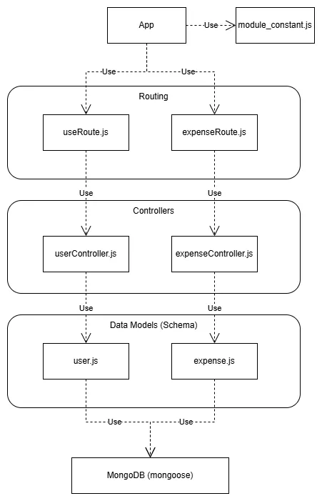
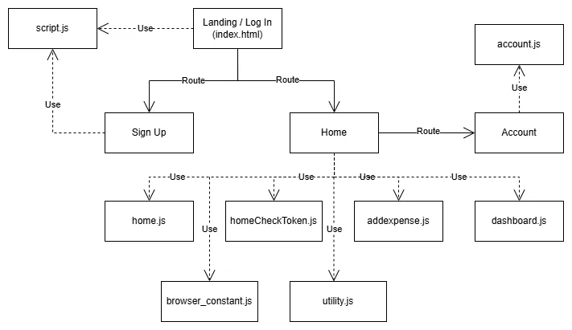
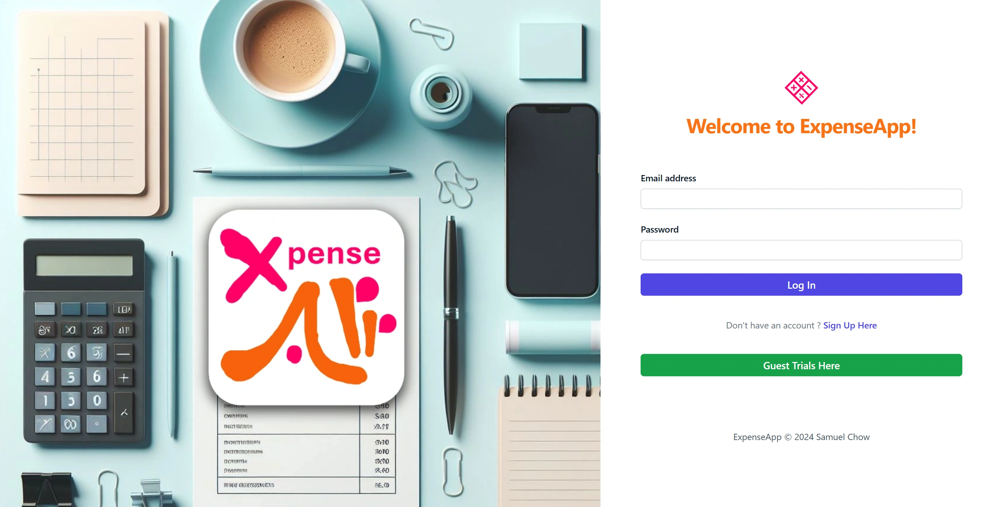
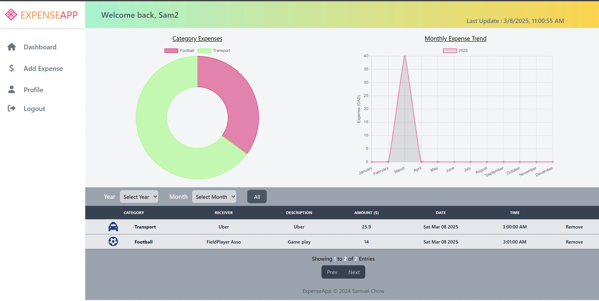
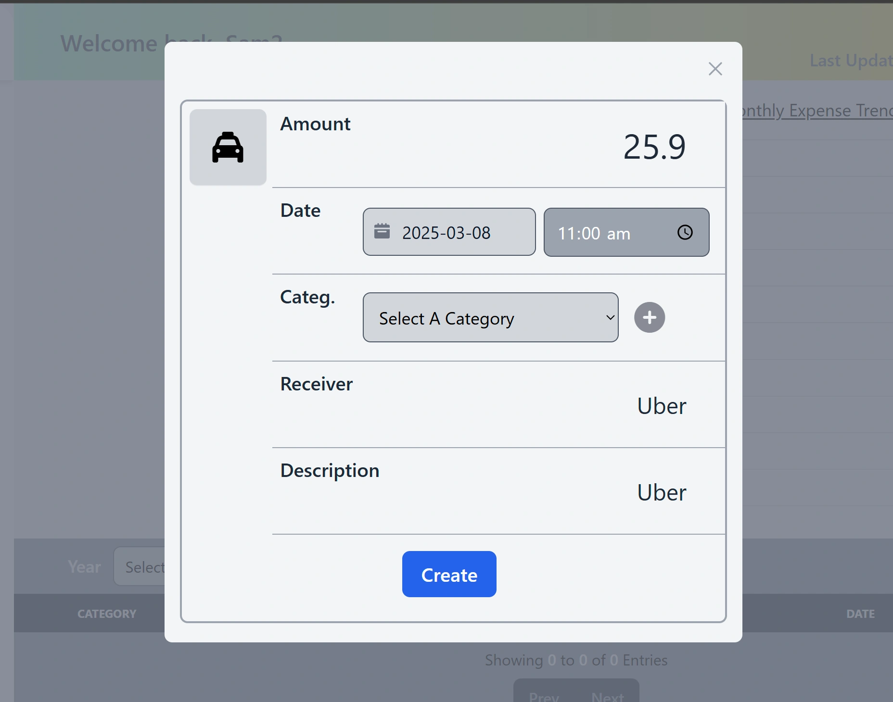
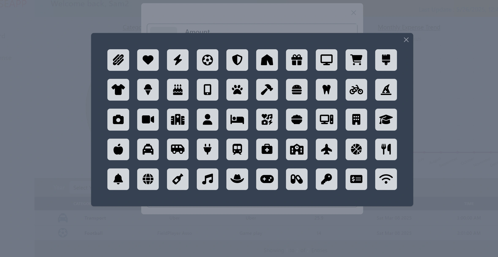
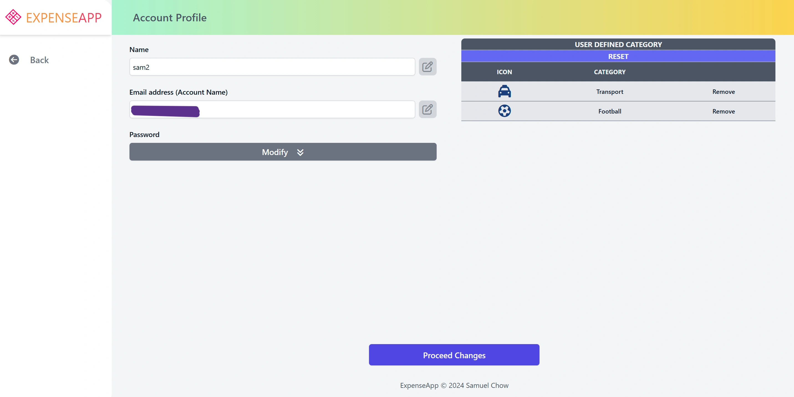

# Project Design Document

## Section 1 - Project Description

### 1.1 Project
Expense Tracker Web Application

### 1.2 Desription
A simple expense tracker that allows users to store their expense records with a detailed tracking history. The application provides account creation functionality to securely store each user’s expense data. Each expense record can be assigned to a custom category, with matching icons from a pre-installed icon pool. The application also supports an expense summary grouped by category, and visualizes the data in a year-month chart for easy tracking and analysis

 

## Section 2 - Library and Database
|Item|Library, Database|
|-|-|
|Database| MongoDB|
|Library| Express, FontAwesome Icon API|

 

## Section 3 - Features and Functionalities

|Item|Features, Functionalities|
|-|-|
|1|Support account creation with signup and login
|2|Support guest trials account creation with auto deletion after expiration
|3|Support tailor category creation with icon matching from icon pool|
|4|Support account name, and password modification
|5|Support per category expense summary into pie chart
|6|Support year month record history line chart

 

## Section 4 - Project Top Level Diagram

### 3.1 Backend

### 3.2 Frontend

 

## Section 5 - UI

END of Document
